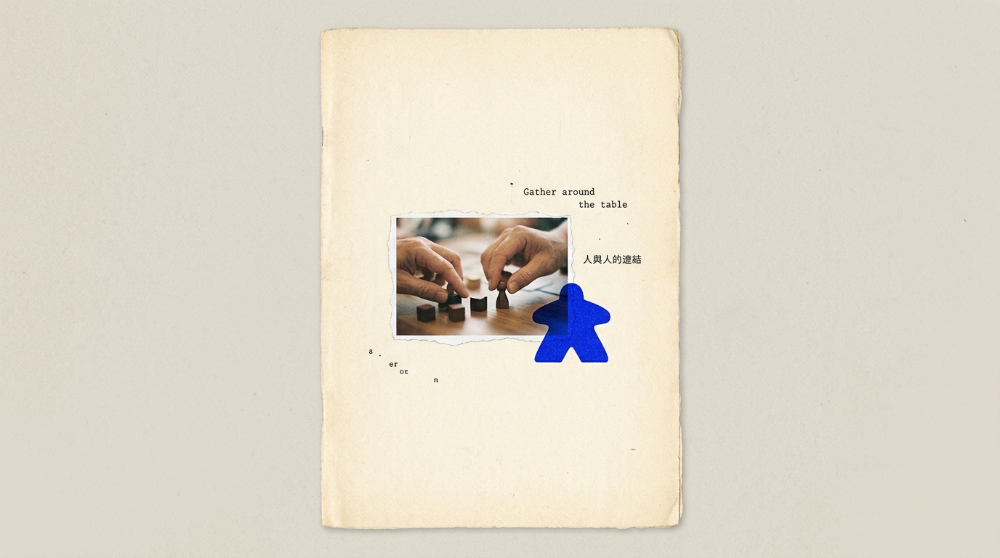

# Reaify Tech 睿非科技 - AI Game Master 智慧桌遊主控旗艦系統

## 📌 專案簡介
本專案為 **睿非科技股份有限公司 (Reaify Tech Co., Ltd.)** 旗艦產品 **AI Game Master** 之官方宣傳單頁網頁與單頁 PDF DM 系統。結合 Nothing 點陣 LED 美學、3D 旋轉模組舞台與 60FPS 零耗能沙丁魚群動態海洋背景。

---

## ✨ 技術亮點

1. **Sardine Engine 5.6 海洋動態魚群引擎**
   - **5 層 3D 景深與魚鱗白黃反光**：隨魚隻擺尾呼吸與轉灣轉向瞬間，呈現忽明忽暗的魚鱗流光閃亮質感。
   - **滑鼠點擊撒飼料**：任意點擊頁面撒出 LED 琥珀金飼料粒子，魚群會快速聚攏爭食。
   - **離屏紋理緩衝 (Offscreen Caching)**：100% 保證毫秒極速 60FPS 零耗能卡頓。

2. **3D 環繞星軌舞台 (3D Orbit Stage)**
   - 4 大核心模組 (`AI GAME MASTER`, `VISION AI`, `NFC SENSOR MATRIX`, `CLOUD DASHBOARD`) 3D 透視環繞旋轉。
   - 點擊卡片開啟 LED 點陣息影彈窗與極簡說明。

3. **Lupi Basics 單色視覺數據圖表 (lieflat-charts)**
   - **F4 Tick Donut**：100 根極細刻度環狀圖，呈現 68% 人力成本節省。
   - **F12 Dumbbell Queue**：啞鈴軌道圖，呈現翻桌率提升 2.4 ~ 3.1 倍。

4. **單頁 A4 PDF DM 精準符合**
   - `pdf_poster.html` 導出為 `Reaify_Tech_AI_Game_Master_DM.pdf`，精準 1 頁 A4 不溢頁。

---

## 📂 主要檔案結構

- `index.html`：官方宣傳單頁網頁主體
- `styles.css`：Nothing LED 點陣與黑橘美學樣式表
- `script.js`：Sardine Engine 5.6、3D Orbit 與圖表互動邏輯
- `pdf_poster.html`：單頁 A4 PDF 專用排版
- `Reaify_Tech_AI_Game_Master_DM.pdf`：最新版本單頁 A4 DM 導出檔
- `hero_product.jpg` / `qr_code.jpg`：官方主視覺與 QR Code 圖片

---

## 🚀 版權宣告
© 2026 睿非科技股份有限公司 版權所有 All Rights Reserved.
